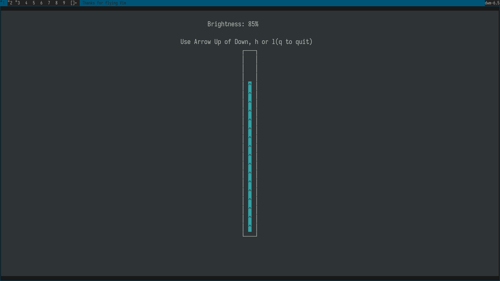

# BRIGHTTUI: Linux Brightness TUI application

> ![WARNING]
> This is might not work for everyone.



## Dependency

The packages required to build it are ncurses and we modify the ***sys/class/backlight***.

To install these packages. Visit your package manager.

## Debian based distro

``` bash
    $ sudo apt install libncurses-dev 
```

## Arch based distro 

``` bash
    $ sudo pacman -S ncurses
```

## How to build

Simply run the make file.

``` bash
    $ make
```

For faster compilation run the following command.

``` bash
    $ make -j$(nproc)
```

For system wide installation just run:
``` bash
    $ sudo make install
```
For uninstall just run:
``` bash
    $ sudo make uninstall
```
